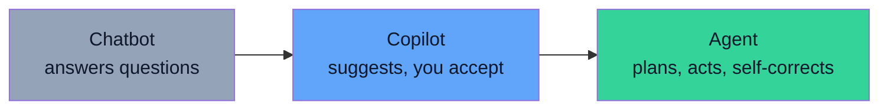
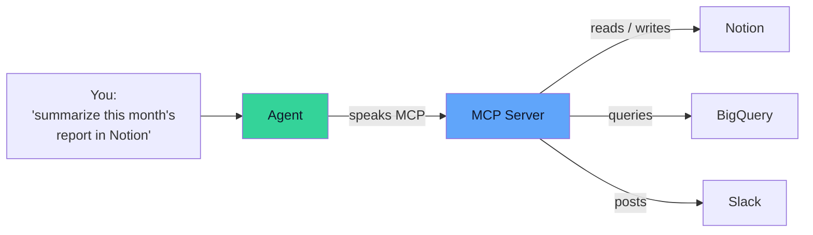
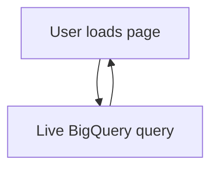
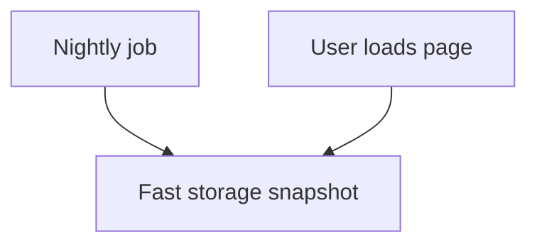

# Beyond Autocomplete, Beyond Vibe-Coding

## Software Engineering at the Tipping Point

**Sean Ramones** 
Silliman University CCS alumnus · Miller Development AB

<!--
Open with the title. Say it like it means something — this room is at the point where knowing syntax stops being the differentiator. Don't over-explain "vibe-coding" yet, that term gets defined properly this afternoon; here it's just a hook.
-->

---

# From Silliman CCS to Miller Development AB

<v-clicks>

- BSIT, right here at Silliman University
- 2018 — full-stack developer at SCI Global Services, building B2B sites for medical and lab clients
- 2019 to now — Miller Development AB, evolving from frontend specialist to **AI-augmented full-stack engineer**
- Today: HR-tech SaaS, ML-integrated platforms, and dashboards for international clients, agent-assisted every day

</v-clicks>

<!--
This replaces the old "I may not be the flashiest speaker" framing — a concrete career snapshot does the same job of lowering performance pressure while giving the room something to actually track. The third beat is the whole talk in miniature: "evolving from frontend specialist to AI-augmented full-stack engineer" is not a title change, it's the thesis. Don't over-explain it here — just let it land, then pay it off properly in Block 2 and 3. This is also the professional-arc counterpart to the AI-learning-curve arc on the "I didn't start out understanding any of this" slide later — two different arcs, don't conflate them when narrating.
-->

---
layout: section
---

# Block 1

## The Industry Shift

<!-- 30-40 minutes. Set up the "AI-assisted dev" timeline before getting to what agentic means. -->

---

# Where this started

Autocomplete. Suggestions. One line at a time.

<v-clicks>

- GitHub Copilot (2021) — predicts the next few lines as you type
- You still drive every keystroke
- No planning, no memory of the last file it touched, no ability to run anything
- It is a very good autocomplete

</v-clicks>

<!--
Ground the room in something most of them have already touched — Copilot-style inline suggestions. Emphasize: this generation of tool has no concept of a task, only "what comes next in this line." That contrast is what makes "agentic" land later.
-->

---

# Where it is now

<v-clicks>

- Agents that read a request, **plan** the steps to satisfy it
- **Use tools** — run code, read files, call APIs, search the web
- **Self-correct** — run a test, see it fail, fix it, run it again
- Work across an entire codebase, not one line

</v-clicks>

Same underlying models. Completely different way of working.

<!--
This is the pivot slide. Don't oversell "AGI" language — keep it mechanical: plan, act, check, repeat. That loop is the entire definition of "agentic" you'll formalize in Block 2.
-->

---
layout: center
class: text-center
---

# I didn't start out understanding any of this

I started out confused by half the terminology in this room

<!--
This is your personal narrative slide. Tell the real arc: you were genuinely uncertain about terms like "agent," "MCP," "context window" not long ago, and built up to production usage through repetition, not some innate talent. This is the most important slide in Block 1 for a room of students — it makes the rest of the talk feel reachable instead of "he was always like this."
-->

---

# The bar moved

### The old differentiator

"Do you know React?"

"Can you write a sorting algorithm on a whiteboard?"

### The new one

"Can you direct an agent to build the right thing, correctly, and catch it when it doesn't?"

<!--
This is the hiring-differentiator reframe from your notes. Land it as an observation from hiring and working alongside other engineers, not a prediction. Knowing a framework is necessary but no longer sufficient — direction and review are the new skill.
-->

---
layout: section
---

# Block 2

## What "Agentic" Actually Means

<!-- 45-60 minutes. This block does the conceptual heavy lifting so Block 3's stories land without re-explaining terms. -->

---

# The spectrum

**Agentic** = autonomy + tool use + multi-step planning + self-correction

<!--
Walk left to right. A chatbot only talks. A copilot suggests inside your editor but you accept every change. An agent plans a sequence of steps, actually executes them using tools, and checks its own work. Give one concrete example per stage if the room looks lost: chatbot = asking ChatGPT a question, copilot = autocomplete-style suggestions, agent = "build me a login page" and it writes the files, runs the app, and fixes the error it hits.
-->

---

# The toolbox, at a concept level

### Claude Code

A terminal-based agent. Give it a task in plain language, it plans, edits files, runs commands, reports back.

### Agent SDKs

Building blocks for developers to wire their *own* agents into products, not just use someone else's.

### MCP

A standard way for an agent to reach *outside* tools — your Notion, your database, your Slack.

<!--
Keep this at "one problem each solves," no implementation detail. Claude Code = an agent you talk to directly. Agent SDKs = for engineers who want to embed agent behavior inside their own software. MCP = the plumbing that lets an agent touch things outside its own sandbox. The next slide diagrams that third one, since it's the least intuitive.
-->

---

# How does an agent read my Notion?

<!--
This demystifies the "magic." MCP is not the agent being clever about Notion specifically — it's a standard protocol, so one agent can speak to many different tools through the same interface, and one tool (Notion, BigQuery, Slack) can be reached by many different agents. That reusability is the actual point of the standard.
-->

---
layout: center
class: text-center
---

# Questions so far?

Before we get into what this looks like in a real day of work

<!--
Deliberate pause point from your notes. Don't rush past it — Block 3 assumes the room is comfortable with chatbot/copilot/agent and with MCP at a concept level. If people are still stuck on those, better to catch it now than mid-story.
-->

---
layout: section
---

# Block 3

## A Day in Sean's Life at Miller Dev

<!-- 45-60 minutes. Four real, anonymized workflow patterns. -->

---

# Write the ADR before you write the code

<v-clicks>

- A short markdown document: what's the context, what did we decide, why
- Not a spec. Not a ticket. A record of a **decision** and the trade-off behind it
- Written **before** touching the codebase
- Then fed to the agent as context

</v-clicks>

The agent's plan is only as good as the decision you handed it

<!--
Introduce the ADR (architecture decision record) practice generically first, then the next few slides show it in action on the BigQuery case. Key point: writing the ADR is a thinking tool for you as much as it is context for the agent. A vague ask produces a vague plan; a clear decision produces a clear one.
-->

---

# Case study: a client dashboard was slow

A client-facing, BigQuery-backed dashboard. Every page load ran a live query.

<v-clicks>

- BigQuery is built to scan huge datasets, not answer one user's click in milliseconds
- Even small queries carried hundreds of milliseconds to several seconds of overhead
- Data only needed to be fresh once a day, not live

</v-clicks>

<!--
This is the BigQuery latency case, anonymized. The root cause is architectural: an analytical warehouse was sitting directly on the interactive request path. Confirm with the room: the fix isn't "make BigQuery faster," it's "stop asking BigQuery on every click."
-->

---

# The decision: precompute, then serve

**Before**

**After**

A scheduled job materializes exactly the data the app needs, once a night. The app never queries BigQuery directly again.

<!--
This is the ADR-0002/0003 precompute-and-serve pattern from your real work, anonymized. The ADR recorded the direction first (precompute, not "cache harder"), then a follow-up ADR nailed the specifics: what storage, what format, what refresh schedule. Point out that this was a two-step decision on purpose — commit to the shape first, argue the details second.
-->

---

# Where the agent came in

<v-clicks>

- Given the ADR as context, it planned the concrete pipeline: what gets exported, on what schedule, into what format
- It surfaced trade-offs I'd have had to look up myself — file format choices, storage options, auth migration
- I reviewed the plan **before** it touched a single file
- It implemented, and I verified against the ADR afterward

</v-clicks>

<!--
This is the "how an agent helped implement/validate it" beat from your brief. Emphasize the review-before-execute step specifically — this is the "critical review" habit the afternoon workshop teaches hands-on. The ADR is what let the agent generate a genuinely useful plan instead of a generic one.
-->

---

# Case study: an unfamiliar codebase, fast

A client had several separate apps sharing one login. Two teams, two codebases, one shared session — except it wasn't shared.

<v-clicks>

- Login lived in one app's local browser storage
- A second app on the same domain had no way to read it
- Users saw a flash of "logged out" on every page load

</v-clicks>

<!--
This is the cross-app auth case, anonymized. Set up the concrete symptom (login flicker, second app not authenticated) before the fix — this is a bug a lot of students will recognize the shape of even if they've never touched auth.
-->

---

# Navigating code I didn't write

<v-clicks>

- I hadn't built either app — this was someone else's architecture
- The agent explored both codebases in parallel, found where sessions were stored, and how each app read them
- It surfaced three real alternatives before I picked one — a relay endpoint, cross-tab messaging, cookie-based sessions
- Cookie-based sessions won: same-origin, readable by both apps' servers, no new infrastructure

</v-clicks>

<!--
The point here is speed of orientation, not cleverness of the fix. An unfamiliar codebase is normally a slow read-everything slog; directing an agent to explore both apps and report back what it found compressed that considerably. The "three real alternatives" detail matters — a good agent plan surfaces trade-offs, it doesn't just pick one.
-->

---

# Not every workflow is "write me a function"

<v-clicks>

- A recurring monthly task: research trending topics in two ecosystems, interview me on what actually shipped, draft two written reports
- Built once as a **skill** — a saved, repeatable agent workflow, not a one-off prompt
- Same five steps every month: research, interview, draft, publish, then a separate explicit step to commit
- The agent performs it consistently because the *process* is written down, not just the goal

</v-clicks>

<!--
This is the monthly SME report workflow case. The point students should take away: agentic engineering isn't only "generate this code once," it's also building durable, reusable processes an agent runs the same way every time. The "separate explicit step to publish" detail is worth calling out — a second human checkpoint before anything becomes final, on purpose.
-->

---
layout: center
class: text-center
---

# The common thread

**Context in**

An ADR, a spec, a clear ask

**Structured process**

A plan, reviewed before it runs

**Human review out**

Checked against what was actually asked

<!--
This is the Block 3 takeaway slide. All four stories share this shape regardless of whether the task was a performance fix, an unfamiliar codebase, or a recurring report. This shape is also exactly what the afternoon workshop has students practice by hand.
-->

---
layout: section
---

# Block 4

## Q&A / Open Discussion

<!-- 20-30 minutes -->

---
layout: center
class: text-center
---

# What does this mean for your career?

Floor is open

<!--
Closing prompt. Let this breathe — don't answer it yourself first. If the room is slow to respond, the next slide has seed questions.
-->

---

# If the room needs a nudge

<v-clicks>

- What's one repetitive task in your coursework you'd want an agent to handle?
- Where do you think "knowing the syntax" stops mattering and "directing well" starts?
- What would make you trust an agent's output less? What would make you trust it more?

</v-clicks>

<!--
Optional backup slide, only surface it if the floor stays quiet after 10-15 seconds. Don't read all three at once — drop one, wait, drop the next only if needed.
-->

---
layout: end
---

# Thank you

This afternoon: you build something with an agent yourself

<!--
Bridge to the afternoon workshop. Reinforce that Block 3 was watching; the afternoon is doing.
-->
